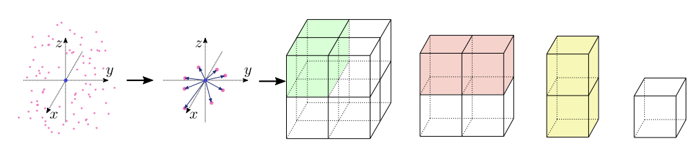

## PointSIFT: A SIFT-like Network Module for 3D Point Cloud Semantic Segmentation

Created by ***

### Introduction

PointSIFT is a semantic segmentation framework for 3D point clouds. It is based on a simple module which extract featrues from neighbor points in eight directions.



### Installation

In our experiment, All the codes are tested in Python3.5(If you use Python 2.7, please add some system paths), CUDA 8.0 and CUDNN 5.1. 

1. Install [TensorFlow](https://www.tensorflow.org/install/) (We use v1.4.1).
2. Install other python libraries like *h5py* 
3. Compile TF operator (Similar to [PointNet++](https://github.com/charlesq34/pointnet2#compile-customized-tf-operators)).  Firstly, you should find Tensorflow include path and library paths.
``` python
    import tensorflow as tf
    # include path
    print(tf.sysconfig.get_include())
    # library path 
    print(tf.sysconfig.get_lib())
```
Then, change the path in all the complie file, like `tf_utils/tf_ops/sampling/tf_sampling_compile.sh`
Finally, compile the source file, we use tf_sampling as example.
``` bash
    cd tf_utils/tf_ops/sampling
    chmod +x tf_sampling_compile.sh
    ./tf_sampling_compile.sh
```

### Usage
If you want use our model in your own project. After compiling the TF operator, you can import it easily. Here shows a simple case.(we take **batch_size * num_point * input_dim** as input and get **batch_size * num_point * output_dim** as output)
``` python
import tensorflow as tf
# import our module
from tf_utils.pointSIFT_util import pointSIFT_module
# input coordinates
xyz = tf.tf.placeholder(tf.float32, shape=(batch_size, num_point, 3))
# input features
point_feature = tf.tf.placeholder(tf.float32, shape=(batch_size, num_point, input_dim)
# setting phases
is_training = tf.placeholder(dtype=tf.bool, shape=())
# setting searching radius (0.1 as an example)
radius = 0.1
_, out_feature, _ = pointSIFT_module(xyz, point_feature, radius, output_dim, is_training)
``` 


### Training and evaluating on ScanNet

1. All the data can be download from [here](https://shapenet.cs.stanford.edu/media/scannet_data_pointnet2.zip). They are the same as [PointNet++](https://github.com/charlesq34/pointnet2/tree/master/scannet).
2. Train the data:
``` bash
python train_and_eval_scannet.py
```
If you have multiple GPU:
``` bash
CUDA_VISIBLE_DEVICES=0,1,2,3 python train_and_eval_scannet.py --gpu_num=4
```